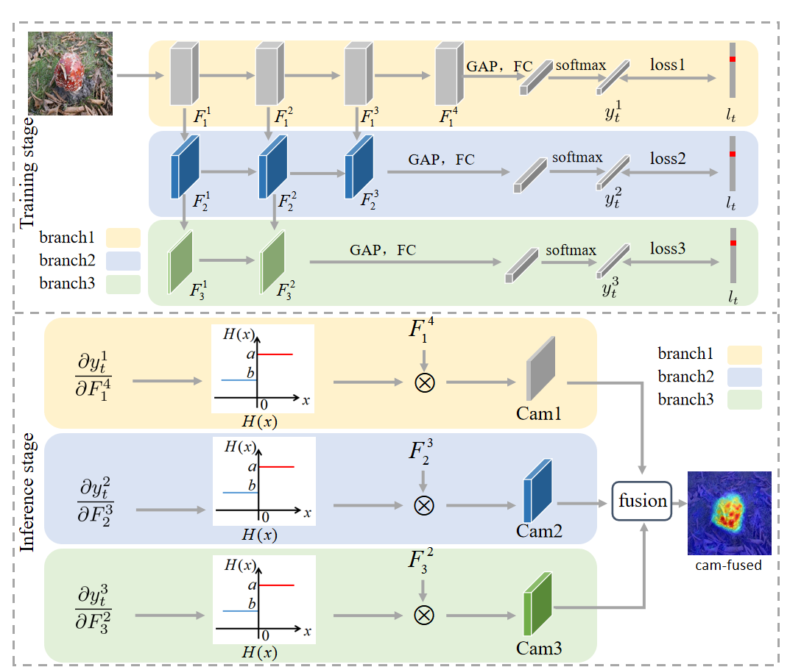
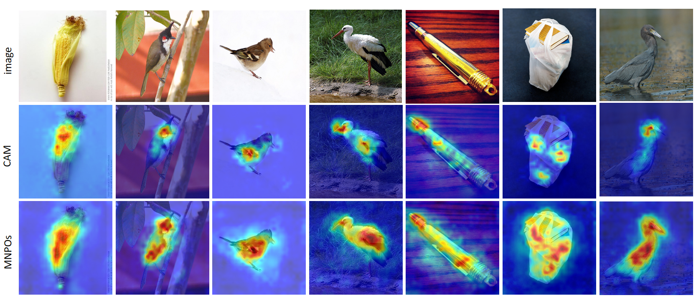
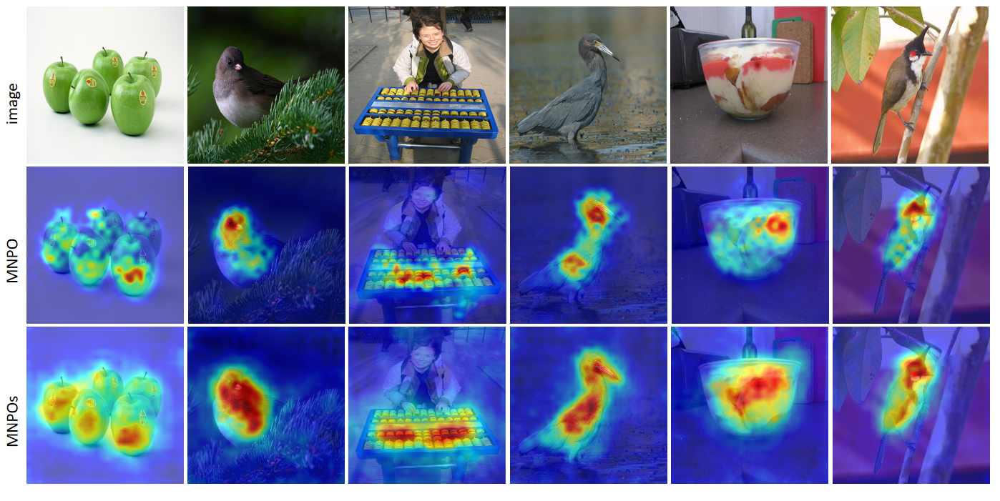

# Multi-branches Network with Post-processing Operations for Weakly Supervised Object Localization

Weakly supervised object localization achieves the localization task using image-level labels. The existing methods exploit the deepest convolution feature maps of the classification network and the Fully-Connected (FC) layer parameters to generate the localization map. However, due to the lacking of shallow edge information, the deep feature maps only identify the discriminative regions, and the resulting blurred localization edges affect the localization accuracy. Additionally, the parameters in the FC layer pay more attention to classification accuracy than localization performance, influencing localization reliability. To develop localization accuracy and reliability, we put forward a novel Multi-branches Network with Post-processing Operation (MNPO), in which multi-branches structure and the post-processing operation for weights are proposed to locate the entire target object. Specifically, the multi-branches structure extracts the shallow edge features by constructing the parallel branches to locate the target object accurately. The main branch mines the discriminative part, and the parallel branch learns the detailed edge part. Then, to implement the localization task better, we propose the weight post-processing mechanism to handle the weighted parameters of the FC layer to retain non-discriminative regions in the final localization map. In such a case, to further utilize the shallow features, we propose the gradient post-processing operation to exploit the gradients of multiple branches for achieving localization on the shallow layer, named MNPOs. Experiments demonstrate the effectiveness of our proposed MNPOs, outperforming existing state-of-the-art methods and improving the localization performance by 2.09% on the ILSVRC dataset and 11.15% on the CUB-200-2011 dataset in terms of the top-1 localization error metric. 

# The proposed MNPOs method


# Trained model

* Download [the trained models] [https://drive.google.com/drive/folders/16d1ygIl6u_e-aNeh19gjiB-c-uY69BaO?hl=zh-TW] on ImageNet at GoogleDrive.

# Pre-requisites
  
 * Python = 3.8.10
 * Pytorch = 1.8.0
 * Torchvision = 0.9.0
 * opencv-python == 4.5.2.52 
 * Pillow == 8.2.0
 * tqdm == 4.60.0

# Localization



# Test
  
```
python3 main.py
```
  
# Citation
  
If you find the code helpful, please consider to cite the paper:
  
```

```

